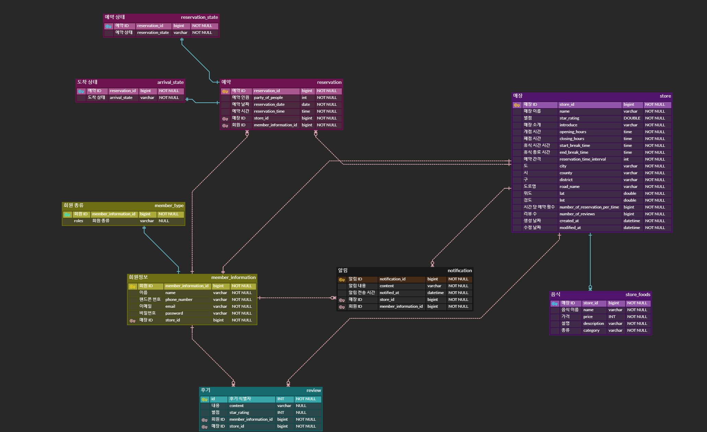

# 음식점 예약 서비스

## 🎯 프로젝트 소개
### 프로젝트 개요
방문하고 싶은 음식점을 예약하거나 매장의 키오스크에서 대기열에 등록할 수 있는 음식점 예약 서비스
### 프로젝트 동기
원하는 매장을 미리 예약하거나 현장 대기 목록에 등록하여 직접 기다려야 하는 문제를 해결하기 위해 제작

## 🛠 사용 기술

### language
- java(Open JDK 11)

### framework
- spring boot 2.7.13, spring security

### ORM
- spring JPA, QueryDsl

### Database
- MySQL
- Redis

### unit test
- Junit 
- mockito

### Infra
- AWS S3

## 💡 ERD

## 아키텍처

## 구현 기능
### 회원
- 로그인하기 
- 로그아웃하기
- 회원 가입하기
  - 아이디: 이메일
    - 이메일 형식을 준수
  - 패스워드
    - 영문 대소문자, 특수문자 1개씩 포함
    - 8자에서 12자 길이 제한
  - 핸드폰 번호
    - 길이 11자
    - 숫자만 포함
- 접근 토큰 재발급하기

### 매장
- 매장 정보 등록하기
- 매장 정보 수정하기
- 고객이 매장 상세 정보 조회하기
- 점장이 자신의 매장 상세 정보 조회하기
- 고객이 조건에 따라 매장 목록 조회하기

### 예약
- 예약하기
  - 예약은 예약 시간 10분 전까지 가능
  - 매장 입장에서 예약을 거절할 수 있음
- 예약 취소하기
  - 예약 취소는 방문 시간 1시간 전까지 가능
- 예약 승인/거절하기
  - 예약 승인/거절은 예약 시간까지 가능
  - 예약 시간까지 승인되지 않은 건에 대해서는 거절로 처리
- 예약 이후 승인되어야 예약 확정
- 예약 고객 방문 처리
  - 방문 확인은 예약 시간 10분 전부터 확인
  - 예약 확정된 건에 대해서만 확인
  - 예약 시간까지 방문 처리되지 않는다면 no-show 처리
- 예약 목록 조회
  - 고객이 자신의 예약 목록 조회
  - 점장이 특정 날짜의 예약 목록 조회
- 고객이 원하는 날짜와 예약 시간에 대한 현재 예약 횟수 조회

### 키오스크
- 현장 고객 대기 접수하기
- 현장 고객 입장 처리하기
  - 현장 대기 고객은 입장 알림 이후 5분이 지나면 취소 처리
  - 입장 알림 이후 5분 내에 방문 처리되어야 함

### 알림
- 예약 알림
- 예약 확정 알림
- 예약 취소 알림
- 방문 예정 알림
- 현장 고객 입장 알림
- 리뷰 작성 알림

### 후기
- 후기 작성
  - 해당 매장의 별점 수정
  - 해당 매장의 후기 갯수 증가
- 후기 수정
- 후기 삭제
  - 해당 매장의 별점 수정
  - 해당 매장의 후기 갯수 감소
- 후기 목록 조회
- 후기 상세 조회
  - 후기 글 전체의 모습을 보여줌

### 이미지
- 이미지 등록하기
  - 매장 메뉴, 사진 후기, 사용자 프로필, 매장 프로필 이미지를 등록 
- 이미지 수정하기
  - 기존의 이미지를 다른 이미지로 수정
- 이미지 삭제하기
- 이미지 불러오기

## API Specification