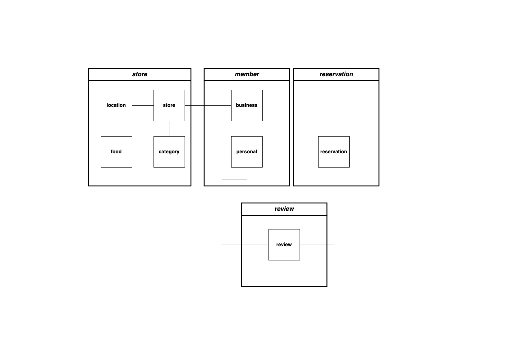
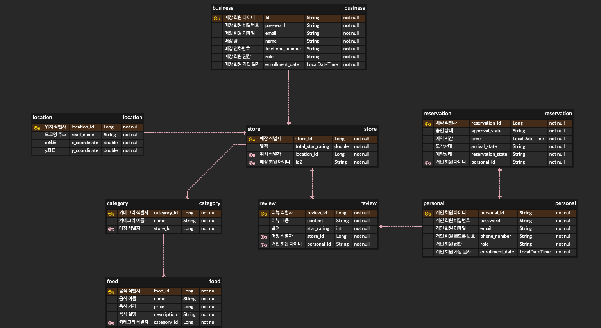

# 매장 테이블 예약 서비스

## 🎯 프로젝트 목표
예약 서비스를 활용하고 싶은 매장은 매장 정보를 등록할 수 있다.   
매장 예약 서비스에 가입한 회원은 방문을 희망하는 매장을 예약할 수 있는 서비스 제작

## 🖥 개발 환경
```text
- java(Open JDK 11)
- gradle 
- spring boot 2.7.13
- spring security, spring JPA, Maria DB
```

## commit rule
- issue 번호를 명시(수정 가능성 O)

- commit 키워드
  - 기능 구현: feat
  - 기능 수정: refactor
  - 문서 작업: docs
  - chore: 의존성 변경, 추가 / 코드 포맷팅


## 📌기능 요구 사항

### 회원 가입 서비스
  - 매장
    - 매장 등록을 위한 파트너 가입 기능
  - 고객
    - 예약 서비스 이용을 위한 가입 기능


### 예약 서비스
  - 매장 정보를 등록하는 기능
  - 매장 검색 기능 
  - 매장 상세 정보 조회 기능
  - 예약자 방문 확인 기능
  - 예약 승인 / 거절 기능
  - 매장 예약 기능


### 리뷰 서비스
  - 리뷰 작성 기능
  - 별점 평가 기능


## 📢 정책

### 회원
  - 회원 가입
    - 아이디: 이메일
    - 패스워드
      - 영문 대소문자, 특수문자 1개씩 포함
      - 8자에서 12자 길이 제한
    - 핸드폰 번호
      - 길이 10자에서 11자
      - 숫자만 포함

### 매장
  - 파트너 회원인 매장만 매장 정보를 등록 가능
  - 파트너 회원 가입 조건 X
  - 파트너 회원 가입 완료 후, 바로 매장 정보 등록이 가능

### 고객
  - 회원 가입된 고객만 매장 예약이 가능
  - 리뷰 작성은 선택 사항 

### 예약
  - 방문 확인은 예약 시간 10분 전부터 확인


### 스케쥴
   - 예약이 되지 않았지만 현재 시간이 예약 시간 20분 전까지 예약되지 않았다면 예약 불가
   - 새벽 5시에 모든 매장의 스케쥴을 자동으로 생성
   - 매장 휴무일이라면 스케쥴 생성 X

## 도메인 클래스 다이어그램


## ERD


### reservation
  - 예약 시 필요한 정보를 가지는 도메인
  - 매장 도메인과는 양방향 1:N 관계
  - 고객 도메인과 양방향 1:1 관계


  - **location**
      - 매장의 위치 정보를 가지는 도메인
  -  **menu**
      - 매장의 판매하는 모든 카테고리의 음식 메뉴 정보를 가지는 value object
  - **menu item**
      - 매장에서 판매하는 음식에 대한 정보를 가지는 value object

### store
  - 매장 정보를 가지는 도메인
  - 매장 정보
    - 회원 등급
    - 위치
    - 메뉴
    - 이름
    - 별점
  
### customer
  - 고객 정보를 가지는 도메인


## 기능 구현 목록

### 회원
- [ ] **회원가입 [ticket 1]**
 

- [ ] **로그인 [ticket 2]**
 
- [ ] **로그아웃 [ticket 3]**
  - [ ] 토큰 삭제[ticket 3-1]


- [ ] **매장 예약 [ticket 4]**
  - [ ] 매장 예약 승인/거절 기능[ticket 4-1]
  - [ ] 매장 예약 가능 여부 판단 기능 [ticket 4-2]
  - [ ] 매장 예약 기능 [ticket 4-3]
  

- [ ] **매장 정보 기입[ticket 5]**
  - [ ] **카테고리[ticket 5-1]**
    - [ ] 음식 카테고리 추가 기능[ticket 5-1-1]
    - [ ] 음식 카테고리 삭제 기능[ticket 5-1-2]
    - [ ] 음식 카테고리 수정 기능[ticket 5-1-3]
    - [ ] 음식 카테고리 조회 기능[ticket 5-1-4]
  - [ ] **메뉴[ticket 5-2]**
    - [ ] 메뉴 추가 기능[ticket 5-2-1]
    - [ ] 메뉴 삭제 기능[ticket 5-2-2]
    - [ ] 메뉴 조회 기능[ticket 5-2-3]
    - [ ] 메뉴 정보 수정 기능[ticket 5-2-4]


- [ ] **리뷰 [ticket 6]**
  - [ ] 리뷰 작성 기능[ticket 6-1]
  - [ ] 별점 평가 기능[ticket 6-2]