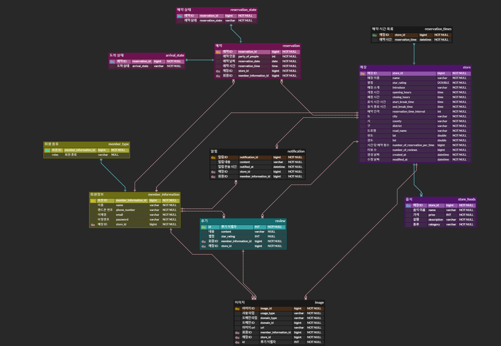

# 음식점 예약 서비스

## 🎯 project introduction
SpringBoot를 이용하여 원하는 음식점을 원하는 시간에 방문할 수 있는 서비스를 구현

## 🛠 development environment

### language
- java(Open JDK 11)
### framework
- spring boot 2.7.13, QueryDsl
### ORM
- spring JPA
### Database
- MySQL
- Redis
### api test
- nGrinder
### unit test
- Junit 
- mockito

## 📜 commit rule
- 기능 구현: feat
- 기능 수정: refactor
- 문서 작업: docs
- 테스트 코드: test
- chore: 의존성 변경, 추가 / 코드 포맷팅

## 💡 ERD


## ✏ implementations

### 회원
- 로그인하기 [X]
- 로그아웃하기 [ ]
- 회원 가입하기 [X]
- 접근 토큰 재발급하기 [ ]

### 매장
- 매장 정보 등록하기 [X]
- 매장 정보 수정하기 [X]
- 고객이 매장 상세 정보 조회하기 [X]
- 점장이 자신의 매장 상세 정보 조회하기 [X]
- 고객이 조건에 따라 매장 목록 조회하기 [X]

### 예약
- 예약하기 [X]
- 예약 취소하기 [ ]
- 예약 승인/거절하기 [X]
- 예약 고객 방문 처리 [X]
- 예약 목록 조회[X]
  - 고객이 자신의 예약 목록 조회 [X]
    - 조회 기간
    - 예약 상태
    - 정렬 조건
  - 점장이 특정 날짜의 예약 목록 조회 [X]
    - 조회 기간
    - 예약 상태
    - 정렬 조건
- 고객이 원하는 날짜와 예약 시간에 대한 현재 예약 횟수 조회[X]

### 키오스크
- 현장 고객 대기 접수하기 [ ]
- 현장 고객 입장 처리하기 [ ]

### 알림
- 예약 알림 [ ]
- 예약 확정 알림 [ ]
- 예약 취소 알림 [ ]
- 방문 예정 알림 [ ]
- 현장 고객 입장 알림 [ ]
- 리뷰 작성 알림 [ ]

### 후기
- 후기 작성 [ ]
  - 해당 매장의 별점 수정[ ]
  - 해당 매장의 후기 갯수 증가[ ]
- 후기 수정 [ ]
- 후기 삭제 [ ]
  - 해당 매장의 별점 수정[ ]
  - 해당 매장의 후기 갯수 감소[ ]
- 후기 목록 조회
  - 후기 글의 일정 길이까지만 보이게끔 수정한 뒤 `...`을 붙임
- 후기 상세 조회
  - 후기 글 전체의 모습을 보여줌
## 📢 Policy

### 회원
- 회원 가입
    - 아이디: 이메일
    - 패스워드
        - 영문 대소문자, 특수문자 1개씩 포함
        - 8자에서 12자 길이 제한
    - 핸드폰 번호
        - 길이 11자
        - 숫자만 포함
### 매장
- 파트너 회원만 매장 정보를 등록 가능
- 파트너 회원 가입 조건 X
- 파트너 회원 가입 완료 후, 바로 매장 정보 등록이 가능

### 고객
- 회원 가입된 고객만 매장 예약이 가능
- 리뷰 작성은 선택 사항

### 예약
- 방문 확인은 예약 시간 10분 전부터 확인[X]
    - 예약 확정된 건에 대해서만 확인[X]
- 예약 승인/거절은 예약 시간까지 가능[X]
    - 예약 시간까지 승인되지 않은 건에 대해서는 거절로 처리
- 예약 이후 승인되어야 예약 확정[X]
- 예약 취소는 방문 시간 1시간 전까지 가능
- 예약은 예약 시간 10분 전까지 가능[X]
    - 매장 입장에서 예약을 거절할 수 있음[X]
- 예약 시간까지 방문 처리되지 않는다면 no-show 처리
    - 해당 매장에 대해 3개월 간 no-show 횟수가 10번 이상이라면 예약 불가
- 현재 no-show 횟수가 20번을 넘어간다면 1개월 간 이용 정지
- 현장 대기 고객은 입장 알림 이후 5분이 지나면 취소 처리
    - 입장 알림 이후 5분 내에 방문 처리되어야 함

## API Specification

### 회원
<details>
<summary>/member/signup</summary>

#### Method
POST
#### 기능 설명
회원가입 요청
#### BODY
```json
{
  "email": "string",
  "password": "string",
  "phoneNumber": "string",
  "roles": [
    "string"
  ],
  "username": "string"
}
```
#### RESPONSE
NONE

#### ERROR
- ALREADY_JOINED_CUSTOMER: 이미 회원가입된 이메일인 경우

</details>


<details>
<summary>/member/signin</summary>

#### Method
POST
#### 기능 설명
회원가입 요청
#### BODY
```json
{
  "email": "string",
  "password": "string"
}
```
#### RESPONSE
{
  ```json
{
  "accessToken": "string"
}
```
}

#### ERROR
- NO_SUCH_MEMBER: 입력받은 이메일 주소를 가진 회원이 없는 경우
- PASSWORD_NOT_MATCH: 입력받은 비밀번호가 일치하지 않는 경우
</details>


---------------------------------------------------------------------------------------------
### 매장
<details>
<summary>/store</summary>

#### Method
POST
#### 기능 설명
매장 정보 생성
#### BODY
```json
{
  "foodDtoList": [
    {
      "category": "string",
      "description": "string",
      "name": "string",
      "price": 0
    }
  ],
  "roadName": "string",
  "storeName": "string",
  "timeDto": {
    "breakTimeEnd": "kk:mm",
    "breakTimeStart": "kk:mm",
    "closingHour": "kk:mm",
    "openingHour": "kk:mm",
    "reservationTimeInterval": 0
  }
}

```
#### RESPONSE
{
  ```json

```
}

#### ERROR
- ALREADY_REGISTERED: 이미 매장 정보를 등록한 경우
- CANNOT_GET_API_RESPONSE: 주소 정보가 올바르지 않은 경우
</details>

<details>
<summary>/store/{storeId}</summary>

#### Method
PUT
#### 기능 설명
매장 정보 수정
#### BODY
```json
{
  "foodDtoList": [
    {
      "category": "string",
      "description": "string",
      "name": "string",
      "price": 0
    }
  ],
  "roadName": "string",
  "storeName": "string",
  "timeDto": {
    "breakTimeEnd": "kk:mm",
    "breakTimeStart": "kk:mm",
    "closingHour": "kk:mm",
    "openingHour": "kk:mm",
    "reservationTimeInterval": 0
  }
}
```
#### RESPONSE
{
  ```json

```
}

#### ERROR
- UPDATE_BEFORE_CREATE_STORE: 매장 정보를 생성하지 않은 상태에서 업데이트하려고 하는 경우
- CANNOT_GET_API_RESPONSE: 주소 정보가 올바르지 않은 경우
</details>

<details>
<summary>/store/customer/{pageIndex}/{pageSize}/{searchCondition}</summary>

#### Method
GET
#### 기능 설명
주어진 위치에서 조건에 따라 정렬된 반경 내 매장 목록을 조회
#### BODY
```json
{
  "latitude": 0,
  "longitude": 0,
  "radius": 0
}
```
#### RESPONSE

  ```json
{
  "content":[
    {
      "content": [
        {
          "storeId": 0,
          "storeName": "String",
          "city": "String",
          "county": "String",
          "district": "String",
          "roadName": "String",
          "starRating": 0.0,
          "openingHours": "kk:mm",
          "closingHours": "kk:mm",
          "breakStartTime": "kk:mm",
          "breakEndTime": "kk:mm",
          "numberOfReviews": 0
        },
        {
          "storeId": 0,
          "storeName": "String",
          "city": "String",
          "county": "String",
          "district": "String",
          "roadName": "String",
          "starRating": 0.0,
          "openingHours": "kk:mm",
          "closingHours": "kk:mm",
          "breakStartTime": "kk:mm",
          "breakEndTime": "kk:mm",
          "numberOfReviews": 0
        },
        ...
      ],
      "pageable": {
        "sort": {
          "sorted": false,
          "unsorted": true,
          "empty": true
        },
        "pageSize": 5,
        "pageNumber": 0,
        "offset": 0,
        "paged": true,
        "unpaged": false
      },
      "totalPages": 20,
      "totalElements": 100,
      "last": false,
      "number": 0,
      "sort": {
        "sorted": false,
        "unsorted": true,
        "empty": true
      },
      "size": 5,
      "numberOfElements": 5,
      "first": true,
      "empty": false
    } 
  ]
}
```
}

#### ERROR
NONE

</details>

<details>
<summary>/store/customer/detail/{storeId}, </summary>

#### METHOD: GET
#### 기능 설명
```text
고객 또는 비회원이 대략적인 매장 세부 정보를 확인
```
#### BODY
NONE
#### RESPONSE
{
  ```json
{
  "storeId": 0,
  "storeName": "String",
  "city": "String",
  "county": "String",
  "district": "String",
  "roadName": "String",
  "starRating": 0.0,
  "openingHours": "kk:mm",
  "closingHours": "kk:mm",
  "breakStartTime": "kk:mm",
  "breakEndTime": "kk:mm",
  "numberOfReviews": 0
}
```
}

#### ERROR
- NO_SUCH_STORE: id와 일치하는 매장을 찾을 수 없는 경우
</details>

<details>
<summary>/store/manager/detail/{storeId}</summary>

#### Method
GET
#### 기능 설명
```text
점장이 자신의 매장 세부 정보를 확인
```
#### BODY
NONE
#### RESPONSE
{
  ```json
{
  "foods": [
    {
      "category": "string",
      "description": "string",
      "name": "string",
      "price": 0
    }
  ],
  "location": {
    "city": "string",
    "county": "string",
    "district": "string",
    "lat": 0,
    "lnt": 0,
    "roadName": "string"
  },
  "numberOfReservationPerTime": 0,
  "numberOfReviews": 0,
  "operationHours": {
    "breakTimeEnd": "kk:mm",
    "breakTimeStart": "kk:mm",
    "closingHour": "kk:mm",
    "openingHour": "kk:mm",
    "reservationTimeInterval": 0
  },
  "reservationList": [
    null
  ],
  "starRating": 0,
  "storeId": 0,
  "storeName": "string"
}
```
}

#### ERROR
- STORE_NOT_FOUND: 점장이 가진 매장을 찾을 수 없는 경우
</details>

--------------------------------------------------------------------------------------------------
### 예약
<details>
<summary>/reservation/{storeId}/</summary>

#### METHOD
POST
#### 기능 설명
고객이 방문하고 싶은 시간과 매장 정보를 이용하여 예약
#### BODY
```json
{
  "reservationDate": "YYYY-MM-dd",
  "reservationTime": "kk:mm",
  "numberOfPeople": 0
}

```
#### RESPONSE
- 200: RESERVE_SUCCESS


#### ERROR
- RESERVATION_FAIL: 요청한 예약 시간의 자리가 부족한 경우
- WRONG_RESERVATION_TIME_REQUEST: 요청한 예약 시간이 매장의 예약 시간과 다른 경우
- ALREADY_RESERVE: 고객이 이미 예약한 경우

</details>

<details>
<summary>/reservation/{reservationId}/store/{storeId}/reservationState</summary>

#### METHOD
PUT
#### 기능 설명
예약 승인 또는 거절 인한 예약 상태 변경
#### BODY
NONE
#### RESPONSE
- 200: RESERVATION_STATUS_CHANGE_SUCCESS

#### ERROR
- INVALID_ACCESS: 본인 매장에 대한 예약이 아닌 예약의 예약 상태를 변경하려는 경우
</details>

<details>
<summary>/reservation/{reservationId}/store/{storeId}/arrivalState</summary>

#### METHOD
PUT
#### 기능 설명
예약 승인 또는 거절 인한 예약 상태 변경
#### BODY
NONE
#### RESPONSE
- 200: RESERVATION_STATUS_CHANGE_SUCCESS

#### ERROR
- INVALID_ACCESS: 본인 매장에 대한 예약이 아닌 예약의 방문 상태를 변경하려는 경우
</details>

<details>
<summary>/reservation/customer/{customerId}?duration= &reservationState= &sortOptions= &pageIndex= &pageSize= </summary>

#### METHOD
GET
#### 기능 설명

#### BODY
NONE
#### RESPONSE
```json
{
  "totalElements": 1,
  "totalPages": 1,
  "hasNextPage": false,
  "content": [
    {
      "reservationStateDto": {
        "reservationState": "APPROVAL",
        "arrivalState": "ARRIVED"
      },
      "reservationTimeDto": {
        "reservationDate": "2024-04-01",
        "reservationTime": "09:30"
      },
      "location": {
        "city": "경기",
        "county": "수원시 권선구",
        "district": "금곡동",
        "roadName": "경기 수원시 권선구 매곡로 100",
        "lat": 37.2708596814335,
        "lnt": 126.956002340097
      },
      "storeName": "나의 매장"
    }...
  ]
}
```

#### ERROR
- INVALID_ACCESS: 조회를 요청한 고객의 예약 목록이 아닌 예약 목록에 접근할 경우
</details>


<details>
<summary>/reservation/store/{storeId}?duration= &reservationState= &sortOptions= &pageIndex= &pageSize= </summary>

#### METHOD
GET
#### 기능 설명
점장이 지난 기간(1주일, 1개월, 3개월, 6개월, 1년, 전체) 별로 매장의 예약 목록 조회
#### BODY
NONE
#### RESPONSE
```json
{
  "totalElements": 1,
  "totalPages": 1,
  "hasNextPage": false,
  "content": [
    {
      "reservationStateDto": {
        "reservationState": "APPROVAL",
        "arrivalState": "ARRIVED"
      },
      "reservationTimeDto": {
        "reservationDate": "2024-04-01",
        "reservationTime": "09:30"
      },
      "numberOfPeople": 3
    }, ...
  ]
}

```

#### ERROR
- INVALID_ACCESS: 조회를 요청한 점장이 소유한 매장의 예약 목록이 아닌 예약 목록에 접근할 경우
</details>

<details>
<summary>/reservation/store/{storeId}?currentDate=kk:mm</summary>

#### METHOD
GET
#### 기능 설명
점장이 매장의 당일 예약 목록을 확인 
#### BODY
NONE
#### RESPONSE
```json
{
  
}
```

#### ERROR
- INVALID_ACCESS: 조회를 요청한 점장이 소유한 매장의 예약이 아닌 예약에 접근할 경우
</details>


<details>
<summary>/reservation/{reservationId}/customer/{customerId}?duration= &reservationState= &sortOptions= &pageIndex= &pageSize= </summary>

#### METHOD
GET
#### 기능 설명
고객이 지난 기간(1주일, 1개월, 3개월, 6개월, 1년, 전체) 별로 예약 목록 조회
#### BODY
NONE
#### RESPONSE
```json
{
  
}
```

#### ERROR

</details>

<details>
<summary>/reservation/{reservationId}/store/{storeId}</summary>

#### METHOD
GET
#### 기능 설명

#### BODY
NONE
#### RESPONSE
```json
{
  
}
```

#### ERROR

</details>

------------------------------------------------------------------------------------------------------
### 알림

<details>
<summary>/notification/subscribe/{customerId}</summary>

#### METHOD
GET
#### 기능 설명

#### BODY
NONE
#### RESPONSE
SseEmitter

#### ERROR

</details>

<details>
<summary>/notification?pageIndex= &pageSize= </summary>

#### METHOD
GET
#### 기능 설명
알림 목록 조회
#### BODY
NONE
#### RESPONSE
```json
{
  "totalElements": 1,
  "totalPages": 1,
  "hasNextPage": false,
  "content": [
    {
      "SendFromWhom": "String",
      "receiveTo": 0,
      "receiveToWhom": "String",
      "message": "String"
    }, ...
  ]
}
```

#### ERROR
- INVALID_ACCESS: 조회를 요청한 점장의 매장 예약이 아닌 예약 세부 정보에 접근할 경우
</details>


------------------------------------------------------------------------------------------------------
### 리뷰

<details>
<summary>/reviews/store/{storeId}</summary>

#### METHOD
POST

#### 기능 설명
매장을 방문한 고객의 리뷰 작성

#### BODY
```json
{
  "customerId": 0,
  "content": "String",
  "starRating": 0
}
```

#### RESPONSE
REVIEW_CREATE_SUCCESS

#### ERROR

</details>

<details>
<summary>/reviews/{reviewId}/store/{storeId}</summary>

#### METHOD
PUT

#### 기능 설명
매장을 방문한 고객의 리뷰 수정

#### BODY
```json
{
  "customerId": 0,
  "content": "String",
  "starRating": 0
}
```

#### RESPONSE
REVIEW_UPDATE_SUCCESS

#### ERROR

</details>


<details>
<summary>/reviews/{reviewId}/customer/{customerId}</summary>

#### METHOD
GET
#### 기능 설명
고객 자신이 작성한 리뷰 상세 보기
#### BODY
NONE
#### RESPONSE
```json
{
  "content": "String",
  "starRating": 0
}
```

#### ERROR

</details>

<details>
<summary>/reviews/store/{storeId}?searchCondition=&sortOption=&pageSize=&pageIndex=</summary>

#### METHOD
GET
#### 기능 설명
매장에 대해 방문한 고객의 리뷰 목록 조회
#### BODY
NONE
#### RESPONSE
```json
{
  "reviewList": [
    {
      "content": "String",
      "starRating": 0
    },
    {
      "content": "String",
      "starRating": 0
    }, ...
  ]
}
```
#### ERROR

</details>


<details>
<summary>/reviews/current/store/{storeId}?searchCondition=&sortOption=</summary>

#### METHOD
GET
#### 기능 설명
매장에 대해 방문한 고객의 리뷰 목록 조회
#### BODY
NONE
#### RESPONSE
```json
{
  "reviewList": [
    {
      "content": "String",
      "starRating": 0
    },
    {
      "content": "String",
      "starRating": 0
    }, ...
  ]
}
```
#### ERROR

</details>

-------------------------------------------------------------------------------------------------------